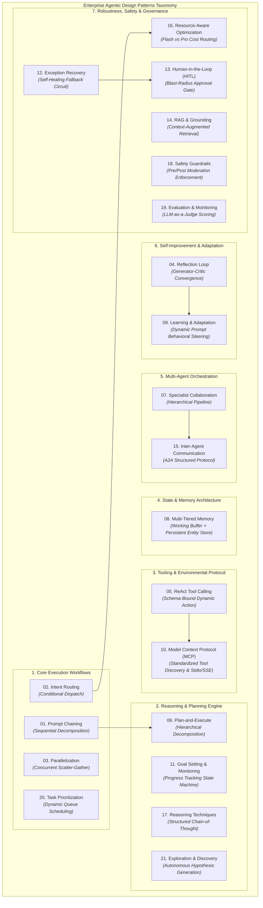
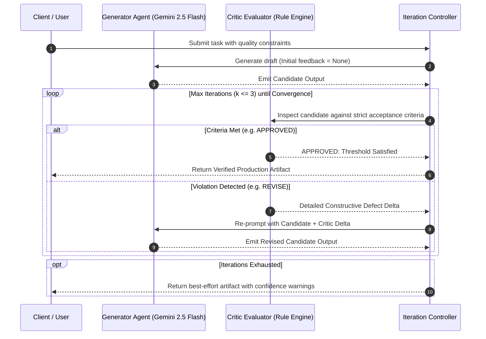
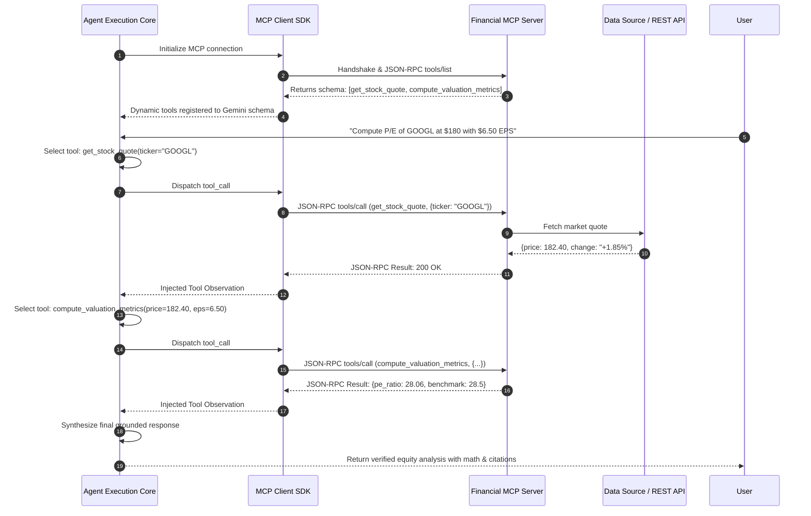
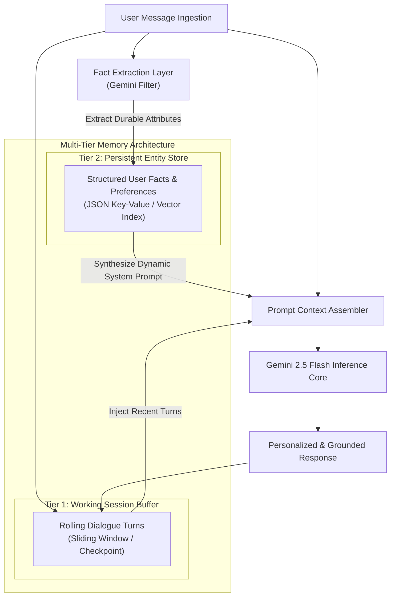

# Production Agentic Design Patterns

[](https://www.python.org/)
[](https://aistudio.google.com/)
[](https://langchain-ai.github.io/langgraph/)
[](https://modelcontextprotocol.io/)
[](https://opensource.org/licenses/MIT)

> **Engineering Design Document & Production Architecture Showcase**  
> **Author:** Ishan Dhiman ([@BigBro2454](https://github.com/BigBro2454))  
> **Target Alignment:** Google Cloud AI / DeepMind / Vertex AI / Production Agentic Engineering  
> **Repository:** [github.com/BigBro2454/agentic-design-patterns](https://github.com/BigBro2454/agentic-design-patterns)

---

## 1. Executive Summary & Systems Problem Statement

Enterprise adoption of Generative AI has reached an architectural inflection point: **monolithic zero-shot prompting is fundamentally insufficient for high-stakes enterprise systems.** When systems attempt to solve non-trivial business workflows with single-turn prompt engineering, they suffer from four catastrophic points of failure:

1. **Error Compounding & Brittle Reasoning:** Multi-step logical deductions executed in a single inference call compound inaccuracies exponentially; a single flawed premise invalidates the entire downstream reasoning chain.
2. **Context Degradation & Token Sprawl:** Stuffing instructions, tools, background knowledge, and conversational history into one massive context window degrades instruction following, inflates TTFT (Time To First Token), and balloons operational inference budgets.
3. **Black-Box Failure Modes:** Monolithic prompt chains fail silently without observable state transitions, deterministic inspection points, or isolated fault recovery.
4. **Proprietary Tool Fragmentation:** Ad-hoc function calling bindings create tight coupling between agent logic and external data sources, preventing portability across runtimes.

This repository provides **21 production-grade, executable implementations of core Agentic Design Patterns** (inspired by research literature and Antonio Gulli's seminal taxonomy), engineered natively with **Google Gemini 2.5 Flash**, **LangGraph**, and the **Model Context Protocol (MCP)**. Each pattern isolates a specific systems failure mode into a modular, observable, and resilient architectural paradigm.

---

## 2. Agentic Pattern Systems Taxonomy

The 21 agent patterns are organized into **seven core systems domains**, spanning micro-workflows to distributed multi-agent swarms:



---

## 3. Deep Architectural Blueprints & Sequence Diagrams

### Sequence A: Reflection & Self-Correction Pattern (`04_reflection`)
Eliminates hallucination and non-compliance by establishing a formal adversarial generator-critic convergence loop with bounded iterations.



---

### Sequence B: Model Context Protocol (MCP) Standardized Runtime (`10_mcp_model_context_protocol`)
Decouples agent reasoning from backend systems through open-standard JSON-RPC 2.0 tool and resource negotiation.



---

### Sequence C: Multi-Tiered Memory Management (`08_memory_management`)
Prevents context rot and ballooning inference costs by partitioning agent memory into transient working memory and durable semantic entity stores.



---

## 4. Comprehensive Pattern Catalog (21 Production Implementations)

| # | Pattern Name | Category | Systems Problem Solved | Google Gemini / LangGraph Architectural Implementation |
| :-: | :--- | :--- | :--- | :--- |
| **01** | `01_prompt_chaining` | Core Workflow | Complex multi-stage transformations fail when executed in a single prompt. | Decomposes task into an extraction chain piped into a structured JSON serialization chain. |
| **02** | `02_routing` | Core Workflow | One-size-fits-all prompts degrade performance on diverse domain queries. | Lightweight classifier categorizes query intent and routes to specialized domain handlers (`tech_support`, `billing`, `general`). |
| **03** | `03_parallelization` | Core Workflow | Sequential generation of independent sub-tasks introduces unacceptable latency. | Dispatches concurrent section drafting via `concurrent.futures` and executes scatter-gather synthesis. |
| **04** | `04_reflection` | Self-Improvement | LLMs lack built-in self-verification, publishing drafts with known constraints violated. | Bounded generator-critic feedback loop that inspects output against acceptance criteria until approval. |
| **05** | `05_tool_use` | Tooling | Static models cannot interact with dynamic systems or retrieve live external data. | Dynamic tool dispatching via LangGraph ReAct agent pattern with schema-bound tool schemas. |
| **06** | `06_planning` | Reasoning | Ambiguous, multi-step goals cause execution drift without explicit milestones. | Plan-and-execute paradigm: decomposes goal into numbered plan and sequentially dispatches execution steps. |
| **07** | `07_multi_agent` | Multi-Agent | Complex deliverables require conflicting skill sets (broad research vs tight prose vs auditing). | Role-based specialization pipeline: Researcher Agent -> Writer Agent -> Senior Editor Agent. |
| **08** | `08_memory_management` | State & Memory | Long sessions cause context bloat; stateless sessions cannot personalize. | Multi-tiered memory combining rolling conversation buffers with persistent entity attribute extraction. |
| **09** | `09_learning_and_adaptation` | Self-Improvement | Agents repeat user corrections across sessions without behavioral updating. | Dynamic prompt augmentation injecting learned user preferences and stylistic heuristics into runtime system instructions. |
| **10** | `10_mcp_model_context_protocol` | Tooling | Proprietary tool interfaces create vendor lock-in and high maintenance overhead. | Standards-compliant Model Context Protocol server exposing tool capabilities over standardized JSON-RPC schemas. |
| **11** | `11_goal_setting_and_monitoring` | Reasoning | Autonomous agents lose track of progress in non-linear workflows. | Goal tracking state machine computing completion percentage and identifying discrete next actions. |
| **12** | `12_exception_handling_and_recovery` | Robustness | Unhandled network timeouts or tool failures terminate agent processes. | Multi-tier retry circuit breaker combined with LLM-driven fallback synthesis when retries are exhausted. |
| **13** | `13_human_in_the_loop` | Robustness | Autonomous execution of irreversible actions (deletions, payments) creates critical risk. | Deterministic escalation barrier gating high-risk command execution behind explicit user confirmation. |
| **14** | `14_knowledge_retrieval_rag` | Context & Data | Models hallucinate private institutional knowledge or outdated training cutoff facts. | Retrieval-Augmented Generation pattern grounding responses strictly in verified retrieved chunks. |
| **15** | `15_inter_agent_communication` | Multi-Agent | Specialist agents operating in silos duplicate work and cannot negotiate data needs. | Standardized Agent-to-Agent request/response protocol for distributed peer communication. |
| **16** | `16_resource_aware_optimization` | Cost & Perf | Running simple queries on flagship models inflates compute costs by 10x+. | Complexity router directing simple queries to fast/economical Flash and complex queries to Pro models. |
| **17** | `17_reasoning_techniques` | Reasoning | Complex logic and mathematical puzzles fail under direct answer generation. | Chain-of-Thought (CoT) prompting enforcing step-by-step intermediate rationales before output generation. |
| **18** | `18_guardrails_and_safety` | Robustness | Raw user prompts can trigger jailbreaks, safety policy violations, or prompt injection. | Input and output moderation guardrail classifying safety compliance prior to pipeline ingestion. |
| **19** | `19_evaluation_and_monitoring` | Observability | Subjective agent quality cannot be tracked across releases without automated evaluation. | LLM-as-a-Judge rubric scoring responses across multi-dimensional metrics (Helpfulness, Tone, Accuracy). |
| **20** | `20_prioritization` | Core Workflow | Concurrent backlog items processed FIFO result in delayed resolution of critical incidents. | Intelligent triage agent ranking asynchronous task queues by urgency, business impact, and SLA requirements. |
| **21** | `21_exploration_and_discovery` | Reasoning | Closed prompts fail at hypothesis generation in open-ended data science discovery. | Creative abduction agent inspecting empirical datasets to propose testable hypotheses. |

---

## 5. L5 Systems & Architectural Trade-off Matrix

Production AI engineering requires balancing competing trade-offs across latency, compute budgets, and reliability:

| Architecture Dimension | Strategy A | Strategy B | Selected Recommendation & Production Trade-off |
| :--- | :--- | :--- | :--- |
| **Workflow Topology** | **Sequential Chaining (`01`)**<br/>• Simple, deterministic<br/>• Latency scales linearly: $O(N)$ | **Parallel Execution (`03`)**<br/>• Fast scatter-gather<br/>• Higher concurrency spikes & rate-limit risks | Use Parallelization for independent sub-tasks; reserve Chaining for strictly dependent transformations. |
| **Tool Integration** | **Ad-Hoc Function Calling (`05`)**<br/>• Low initial boilerplate<br/>• Brittle, tightly coupled | **Model Context Protocol (`10`)**<br/>• Universal JSON-RPC standard<br/>• Requires running MCP runtime | **Standardize on MCP** for all external integrations to enable seamless cross-model portability. |
| **Agent Topology** | **Monolithic Agent**<br/>• Single prompt context<br/>• High context degradation | **Specialist Multi-Agent Swarm (`07`)**<br/>• Modular, auditable roles<br/>• Inter-agent latency overhead | **Multi-Agent DAGs** are superior for complex workflows where roles require isolated personas. |
| **Inference Cost Routing** | **Uniform Model Tier**<br/>• Predictable output quality<br/>• Wasteful compute on simple tasks | **Resource-Aware Dynamic Routing (`16`)**<br/>• Route to Flash vs Pro<br/>• Extra routing step (~150ms) | **Resource-Aware Routing** achieves 60-80% cost reduction in production workloads at negligible latency penalty. |
| **State Retention** | **Full Context History**<br/>• Retains complete transcript<br/>• Context window exhaustion | **Multi-Tier Memory (`08`)**<br/>• Sliding window + Entity extraction<br/>• Requires fact-extraction pass | **Multi-Tier Memory** guarantees bounded context consumption while preserving durable user preferences. |

---

## 6. Production Guardrails & Failure Modes

When moving agent patterns from prototype to enterprise production, systems engineers must enforce strict operational constraints:

1. **Cycle Detection & Bounded Retries:**
   - Patterns with iterative feedback loops (`04_reflection`, `12_exception_handling`) must implement deterministic maximum iteration counters ($k \le 3$) to prevent infinite execution loops and billing runaways.
2. **Blast-Radius Containment (HITL):**
   - Destructive operations (filesystem mutation, database writes, external network requests, API credit consumption) must be classified by risk tier; high-risk operations must mandate human cryptographic approval (`13_human_in_the_loop`).
3. **Structured JSON Validation:**
   - Inter-chain data passing (`01_prompt_chaining`, `15_inter_agent_communication`) must validate payloads against Pydantic schemas, raising validation errors rather than allowing corrupted strings to propagate.
4. **Graceful Degraded State (Fail-Open vs Fail-Safe):**
   - If downstream services or models encounter rate limits (HTTP 429), agents must degrade gracefully via cached responses or local backup runtimes rather than throwing unhandled exceptions.

---

## 7. Quickstart & Installation

### Prerequisites
- Python 3.10 or higher
- A Google Gemini API Key from [Google AI Studio](https://aistudio.google.com/)

### 1. Clone & Setup Virtual Environment
```bash
git clone https://github.com/BigBro2454/agentic-design-patterns.git
cd agentic-design-patterns

python3 -m venv .venv
source .venv/bin/activate
pip install -r requirements.txt
```

### 2. Configure Credentials
```bash
cp .env.example .env
# Edit .env and paste your GEMINI_API_KEY:
# GEMINI_API_KEY="AIzaSy..."
```

---

## 8. CLI Runner: Executing the 21 Patterns

This repository includes a unified CLI dispatcher (`run_pattern.py`) to inspect and execute any of the 21 patterns cleanly.

### List All Patterns & Taxonomy
```bash
python run_pattern.py --list
```

### Execute Individual Patterns
```bash
# Execute by pattern number:
python run_pattern.py 01       # Prompt Chaining
python run_pattern.py 04       # Reflection Loop
python run_pattern.py 05       # LangGraph Tool Calling (ReAct)
python run_pattern.py 08       # Multi-Tiered Memory
python run_pattern.py 10       # Model Context Protocol (MCP) Runtime
python run_pattern.py 16       # Resource-Aware Model Routing

# Execute by keyword:
python run_pattern.py mcp
python run_pattern.py routing
python run_pattern.py reflection
```

Alternatively, navigate into any pattern directory and run directly:
```bash
python patterns/10_mcp_model_context_protocol/run.py
```

---

## 9. Repository Structure

```
agentic-design-patterns/
├── .env.example               # Safe environment variable template
├── .gitignore                 # Zero-leak Git exclusion rules
├── LICENSE                    # MIT Open Source License
├── pyproject.toml             # Modern PEP 517/621 packaging metadata
├── README.md                  # L5 Systems Architecture & Design Document
├── requirements.txt           # Verified Python dependencies
├── run_pattern.py             # Unified CLI runner & taxonomy inspector
├── shared/
│   └── llm.py                 # Centralized Gemini & LangChain client factory
└── patterns/
    ├── 01_prompt_chaining/run.py
    ├── 02_routing/run.py
    ├── 03_parallelization/run.py
    ├── 04_reflection/run.py
    ├── 05_tool_use/run.py
    ├── 06_planning/run.py
    ├── 07_multi_agent/run.py
    ├── 08_memory_management/run.py
    ├── 09_learning_and_adaptation/run.py
    ├── 10_mcp_model_context_protocol/run.py
    ├── 11_goal_setting_and_monitoring/run.py
    ├── 12_exception_handling_and_recovery/run.py
    ├── 13_human_in_the_loop/run.py
    ├── 14_knowledge_retrieval_rag/run.py
    ├── 15_inter_agent_communication/run.py
    ├── 16_resource_aware_optimization/run.py
    ├── 17_reasoning_techniques/run.py
    ├── 18_guardrails_and_safety/run.py
    ├── 19_evaluation_and_monitoring/run.py
    ├── 20_prioritization/run.py
    └── 21_exploration_and_discovery/run.py
```

---

## 10. License & Attributions

Distributed under the **MIT License**. See [`LICENSE`](./LICENSE) for details.  
Architectural patterns based on concepts from *Agentic Design Patterns* by Antonio Gulli, adapted for Google Gemini, LangGraph, and modern enterprise AI systems by [Ishan Dhiman](https://github.com/BigBro2454).
